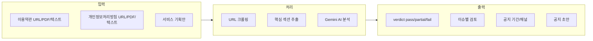
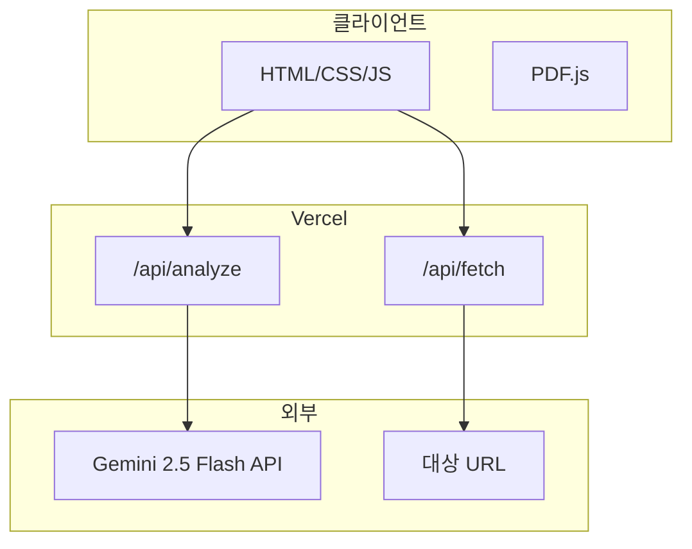

# Lawform 서비스 기획안

## 1. 서비스 개요

### 1.1 서비스명
**Lawform** - 우리 회사 AI Compliance Team

### 1.2 한 줄 소개
이용약관·개인정보처리방침을 복붙만 하면 AI가 준법 검토해주는 웹 서비스

---

## 2. 제작 목적 및 배경

### 2.1 왜 만들었는가

- **타깃**: 법무팀/준법지원팀이 없는 스타트업, 소규모 서비스 운영자
- **문제**: 새 기능 기획 시 이용약관·개인정보처리방침 준법 여부를 직접 검토하기 어렵고, 법률 자문 비용 부담
- **해결**: AI가 기획안과 약관/방침을 비교해 준법 검토, 리스크·공지 의무·개정 초안까지 제공

### 2.2 핵심 가치

- **접근성**: URL/PDF/직접입력으로 문서 입력, 복붙만으로 검토 가능
- **비용 절감**: Gemini Flash 무료 티어 활용, 별도 법률 자문 없이 1차 검토
- **실용성**: 공지 기간(7일/30일), 공지 채널, 공지 초안(이메일/띠배너/공지사항)까지 제공

### 2.3 서비스 컨셉 (메타 문구)

> "우리 회사만 없어,,, 운영자가 화나서 만들어 버린 AI 준법 검토. 그냥 복붙만 하세요."

---

## 3. 핵심 기능



| 기능 | 설명 |
|------|------|
| 문서 수집 | URL 크롤링, PDF 파싱, 직접 텍스트 입력 |
| 준법 검토 | 기획안 vs 약관/방침 비교, severity(critical/warning/info/ok) 판정 |
| 공지 가이드 | 약관규제법·전자상거래법·개인정보보호법 기준 7일/30일, 채널 제안 |
| 공지 초안 | 이메일/띠배너/공지사항용 문구 자동 생성 |

---

## 4. 기술 스택

### 4.1 아키텍처 개요



### 4.2 상세 기술 스택

| 구분 | 기술 | 용도 |
|------|------|------|
| **프론트엔드** | HTML5, CSS3, Vanilla JavaScript | SPA 없이 단일 페이지 앱 |
| **폰트** | Pretendard, JetBrains Mono (Google Fonts) | 한글·코드 가독성 |
| **PDF** | PDF.js 3.11.174 (CDN) | 클라이언트 PDF 파싱 |
| **백엔드** | Node.js 18+ (http, https, fs, path, url) | 로컬 서버, 의존성 없음 |
| **AI** | Google Gemini 2.5 Flash API | 준법 검토 프롬프트 실행 |
| **배포** | Vercel | 정적 호스팅 + Serverless Functions |
| **환경** | .env (GEMINI_API_KEY) | API 키 관리 |

### 4.3 프로젝트 구조

```
lawform/
├── public/           # 정적 파일 (Vercel output)
│   ├── index.html
│   ├── favicon.ico
│   └── images/
├── api/              # Vercel Serverless Functions
│   ├── fetch.js      # GET /api/fetch?url=... (URL 크롤링)
│   └── analyze.js    # POST /api/analyze (Gemini 분석)
├── lib/              # 공통 로직
│   ├── fetchUrl.js   # URL 크롤링, htmlToText
│   ├── extract.js    # 핵심 섹션 추출 (토큰 절감)
│   └── gemini.js     # Gemini API 호출
├── server.js         # 로컬 개발용 HTTP 서버
├── vercel.json       # Vercel 설정
└── package.json
```

### 4.4 최적화 전략

- **토큰 절감**: `extractRelevantSections()`로 개인정보·수집·이용 등 키워드 기반 핵심 문장만 추출 (최대 6000자)
- **로컬 캐시**: URL 크롤링 결과 1시간 메모리 캐시 (로컬 서버 한정)
- **무료 티어**: Gemini 2.5 Flash 무료 티어 활용

---

## 5. 면책 및 한계

- AI 기반 참고용이며 법적 자문을 대체하지 않음
- 실제 개정 전 법무팀 검토 권장
- 모바일 반응형 미적용 (데스크톱 우선)
